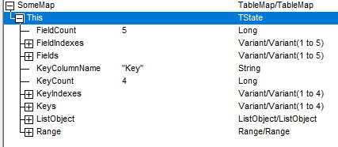

# Model
## Local
- ~~Also a mess. Refactor together with `Query`~~.
  - Refactored.
## Remote
- Wraps Keys, Fields and Values class. 
  - These do not have a dependency on Query.
- Has a dependency on Query. 
```vb
Load(REMOTE_WORKBOOK)
Push(Query)
Pull(Query)
```
## Keys
```vb
Load(REMOTE_KEYS_WORKSHEET)
' Returns a Variant(1 to n) list. 
' Automatically adds new IDs to table.
GetIDsFromQuery(KeyPath As String, KeyPaths as Variant)
```

## Fields
```vb
Load(REMOTE_FIELDS_WORKSHEET)
' Returns a Variant(1 to n) list. 
' Automatically adds new IDs to table.
GetIDsFromQuery(FieldPaths as Variant, FieldNames as Variant)
```

## Values
```vb
Load(REMOTE_VALUES_WORKSHEET)

' Returns a Variant(1 to n, 1 to 1) of Latest Values for a given list of KeyIDs (1 to n) and a single FieldID. These are the RemoteKeyIDs and RemoteFieldID!
PullValues(ByVal KeyIDs As Variant, ByVal FieldID As String) As Variant

' Updates the store with a single field of values.
' Params: KeyIDs(1 to n), FieldID is singular, Values(1 to n, 1 to 1)
PushValues(ByVal KeyIDs As Variant, ByVal FieldID As String, ByVal Values As Variant)
```
## Commits
- NYI
## Query
- ~~Contains too much code. First on list to be be refactored~~.
  - Refactored.
## TableMap
- Field Count, Indexes, ListColumnNames
- Key Count, Indexes, (Local)Values
- KeyColumnName as String
- Reference to `ListObject`
- Reference to `Range`
- No reference to Values - this is obtained via Range object.

