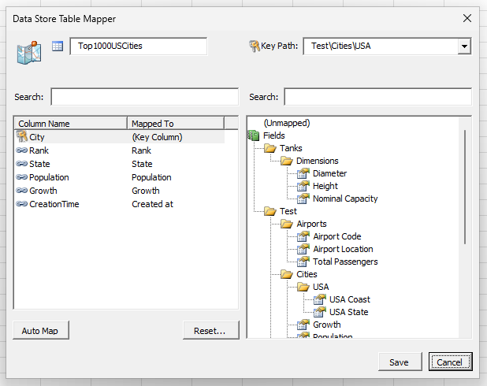

# Excel Data Store
A system for centralising data from multiple Excel worksheets and storing it in a single repository.

Excel is Not a Database™. But in the real world, Excel *is* where we end up storing much of our data. 

This system tries to bridge that gap by providing a single source of truth inside of Excel, letting us store and retrieve data rapidly and seamlessly, with as little friction as possible from our current workflows.

> [!CAUTION]
> This project is not yet ready for production use. It is still in development.

## ⭐ Features
- [x] Map tables in Excel worksheets to the keys and values in the repository.
- [x] Pull data from the repository to update a table.
- [x] Push the latest data from a table to the repository.
- [x] Keep track of when updates were made and where they came from.

## 📸 Screenshots
### Data Flow
Data is `Pushed` from the table in the top left to the central repository at the bottom of the screen. The table on the top right then executes a dry-run and `Pulls` data from the repository,  highlighting any changes to the existing values before replacing it.

## 📝 Notes
- 🩹 [Patch Notes](Notes/PatchNotes.md)
- 🚧 [TODO](Notes/TODO.md)
- ☕ [History behind Table Transfer Tool](Notes/History.md)
  
## 🙏 Thanks
- Developed using [Rubberduck VBA](https://github.com/rubberduck-vba/Rubberduck) and greatly inspired by [Mathieu Guindon](https://github.com/retailcoder/)'s blog posts.